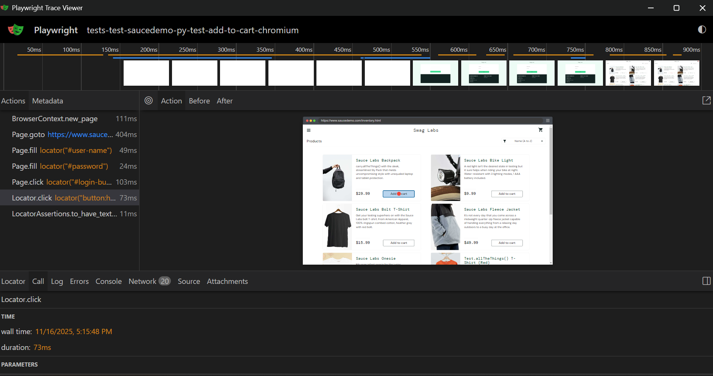

# QA UI Automation – Python + Playwright + pytest

[](https://github.com/OfficialV1R0/qa-ui-automation-python/actions/workflows/pytest.yml)

Automatizované UI testy pro [Sauce Demo](https://www.saucedemo.com) v Pythonu (Playwright + pytest). CI (GitHub Actions) běží headless na Ubuntu, ukládá trace artefakty pro každý běh.

## Scénáře
- Login success
- Login invalid (negativní)
- Locked out user (negativní)
- Add to cart
- Remove from cart
- Logout

## Jak spustit lokálně
```powershell
cd "C:\Users\oulic\Desktop\QA portfolio\qa-ui-automation-python"
python -m venv .venv
.\.venv\Scripts\Activate.ps1
pip install -r requirements.txt
python -m playwright install
pytest -vv
```

## CI
Workflow: `.github/workflows/pytest.yml`  
Artifact: `ui-test-artifacts` (obsahuje trace.zip pro každý test)

## Otevření Playwright trace
```powershell
# aktivace prostředí
cd "C:\Users\oulic\Desktop\QA portfolio\qa-ui-automation-python"
.\.venv\Scripts\Activate.ps1

# otevření konkrétního trace
python -m playwright show-trace ".\ui-test-artifacts\tests-test-saucedemo-py-test-add-to-cart-chromium\trace.zip"
```

### Ukázka trace (Add to cart)


Trace Viewer umožňuje:
- Timeline kroků (fill, click, assertions)
- Síťové požadavky (Network panel)
- Console logy a DOM snapshoty
- Analýzu času trvání jednotlivých akcí

## Co se naučeno
- Playwright (Python) – psaní synchronních UI testů
- Pytest fixtures pro reuse přihlašovacích kroků
- GitHub Actions – headless běh a upload artefaktů
- Analýza trace (timeline, network, assertion detail)

## Další možnosti rozšíření (future work)
- Paralelní běh v několika prohlížečích (`pytest -n auto` + matrix pro browsers)
- HTML report (`pytest-html`)
- Allure report pro detailní historii
- Parametrizace testů (`pytest.mark.parametrize` pro varianty loginů)
- Negativní testy pro neplatné položky nebo manipulaci s košíkem
